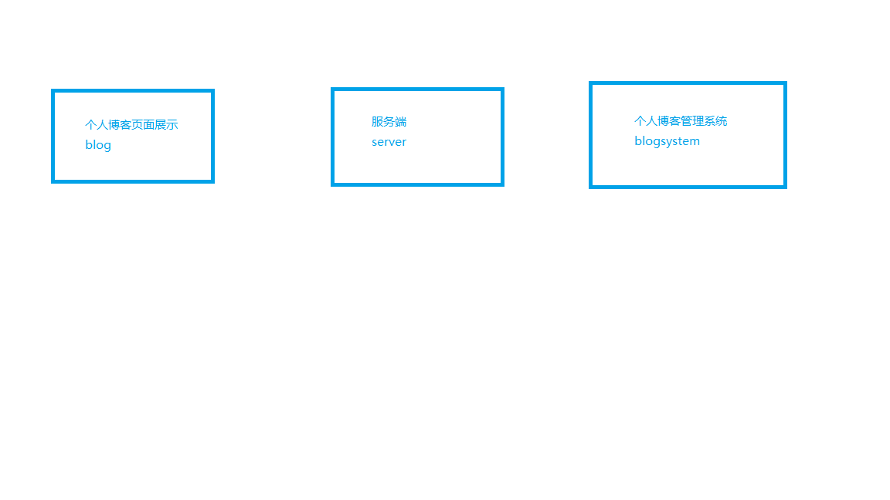

# 个人博库项目搭建过程

## 00-开发过程遇到的问题

> **遇到提交项目后 blog文件夹图标有个箭头然后点不开的问题**

原因： blog文件夹有子仓库
解决方法：删除本地blog里的子仓库.git文件， 然后用 `git rm --cached repo(那个链接仓库的子文件夹的名字)`命令删除缓存后。重新上传到github上。 

> **开发项目都会遇到的跨域问题**

解决方法：使用 egg-cors 解决跨域问题

+ 安装 egg-cors

+ 在 后端server 中的config/plugin.js 文件 开启 egg-cors 写入如下代码:

```js
exports.cors: {
    enable: true,
    package: 'egg-cors'
}
```

+ 在 config/default.plugin.js文件 配置如下代码就完成了

```js
config.security = {
　csrf: {
　　enable: false
　},
　domainWhiteList: [ '*' ]
};
config.cors = {
  origin: '*',
  allowMethods: 'GET,HEAD,PUT,POST,DELETE,PATCH,OPTIONS'
};
```

## 01-项目整体结构



## 02-个人博客blog部分项目环境搭建

`blog`部分需要`SEO`操作，所以考虑使用` Next.js`框架然后配合 `Ant Desgin` 搭建博客页面
+ [Next.js官网](https://nextjs.frontendx.cn/)

> **用 `create-next-app` 快速搭建项目**

+ `npm install -g create-next-app`
+ `npx create-next-app blog`

> **项目部分文件结构简单介绍**
 
 + components文件夹: 专门放在组建
 + pages文件夹： 放置页面的，这里边的内容会自动生成路由，并在服务器端渲染，渲染好后进行数据同步。
 + static文件夹： 这个是静态文件夹，比如项目需要的图片、图标和静态资源都可以放到这里。

> **让Next支持CSS文件**

+ `npm install --save @zeit/next-css`

在 blog根目录下 新建一个 `next.config.js` 文件。是Next.js的总配置文件，加入下面的代码

```js
const withCss = require('@zeit/next-css')

if(typeof require !== 'undefined'){
    require.extensions['.css']=file=>{}
}

module.exports = withCss({})
```

> **引入 Ant Design**

+ `npm install antd --save` 
+ 安装 `npm install babel-plugin-import` 
+ 在blog根目录下新建一个 .babelrc 文件 写入如下配置:

```js
{
    "presets":["next/babel"],  //Next.js的总配置文件，相当于继承了它本身的所有配置
    "plugins":[     //增加新的插件，这个插件就是让antd可以按需引入，包括CSS
        [
            "import",
            {
                "libraryName":"antd"
            }
        ]
    ]
}
```

> **测试**

先在 pages目录下， 新建一个 `_app.js`文件。关于这个文件是什么用的，查看[官网自定义<App>](https://nextjs.frontendx.cn/docs/#%E8%87%AA%E5%AE%9A%E4%B9%89%3Capp%3E)。 

引入 Ant Design 全局样式

```js
import App from 'next/app'
import 'antd/dist/antd.css'
export default App
```

## 03-Header组件的搭建

+ 创建 components/Header.js组件

考虑到 PC端 和 移动端的使用，所以使用 Ant Design 的 栅格 Grid 配合 rem来实现响应式。

+ 创建 static/style/commponents/header.css 样式 

在 Header组件引入这个样式

## 04-首页 中间部分 左右两列布局

博客是左右两列布局的，同时也要考虑适配不同设备的。依然使用栅格。

index.js 基础结构

```js
import React from 'react'
import Head from 'next/head'
import { Row, Col, Menu } from 'antd';
import Header from '../components/Header'

const Home = () => (
  <>
    <Head>
      <title>Home</title>
    </Head>
    <Header />
    <Row className="common-main" type="flex" justify="center">
      <Col className="common-left" xs={24} sm={24} md={16} lg={18} xl={14}>
        左侧
      </Col>
      <Col className="common-right" xs={0} sm={0} md={7} lg={5} xl={4}>
        右侧
      </Col>
  </Row>
 </>
)

export default Home
```

## 05-编写 首页中间部分基本结构 

+ 博客文章的渲染采用 Ant Design 的List列表组件渲染。

先伪造点假数据

```js
const [ mylist , setMylist ] = useState(
    [
      {title:'如何快速开发应该学会如何优雅的 Ctrl + C 和 Ctrl + V',context:'Vue是一套用于构建用户界面的渐进式框架。个人太喜欢Vue相类似的些Logo了嘻嘻嘻。Vue是一套用于构建用户界面的渐进式框架。个人太喜欢Vue相类似的Logo了嘻嘻嘻。Vue是一套用于构建用户界面的渐进式框架。个人太喜欢Vue相类似的些Logo了嘻嘻嘻。Vue是一套用于构建用户界面的渐进式框架。个人太喜欢Vue相类似的些Logo了嘻嘻嘻。Vue是一套用于构建用户界面的渐进式框架。个人太喜欢Vue相类似的些Logo了嘻嘻嘻。Vue是一套用于构建用户界面的渐进式框架。个人太喜欢Vue相类似的些Logo了嘻嘻嘻。Vue是一套用于构建用户界面的渐进式框架。个人太喜欢Vue相类似的些Logo了嘻嘻嘻。Vue是一套用于构建用户界面的渐进式框架。个人太喜欢Vue相类似的些Logo了嘻嘻嘻。Vue是一套用于构建用户界面的渐进式框架。个人太喜欢Vue相类似的些Logo了嘻嘻嘻。Vue是一套用于构建用户界面的渐进式框架。个人太喜欢Vue相类似的些Logo了嘻嘻嘻。Vue是一套用于构建用户界面的渐进式框架。个人太喜欢Vue相类似的些Logo了嘻嘻嘻。Vue是一套用于构建用户界面的渐进式框架。个人太喜欢Vue相类似的些Logo了嘻嘻嘻。'},
      {title:'如何快速开发应该学会如何优雅的 Ctrl + C 和 Ctrl + V',context:'Vue是一套用于构建用户界面的渐进式框架。个人太喜欢Vue相类似的些Logo了嘻嘻嘻。Vue是一套用于构建用户界面的渐进式框架。个人太喜欢Vue相类似的些Logo了嘻嘻嘻。Vue是一套用于构建用户界面的渐进式框架。个人太喜欢Vue相类似的些Logo了嘻嘻嘻。Vue是一套用于构建用户界面的渐进式框架。个人太喜欢Vue相类似的些Logo了嘻嘻嘻。Vue是一套用于构建用户界面的渐进式框架。个人太喜欢Vue相类似的些Logo了嘻嘻嘻。Vue是一套用于构建用户界面的渐进式框架。个人太喜欢Vue相类似的些Logo了嘻嘻嘻。Vue是一套用于构建用户界面的渐进式框架。个人太喜欢Vue相类似的些Logo了嘻嘻嘻。Vue是一套用于构建用户界面的渐进式框架。个人太喜欢Vue相类似的些Logo了嘻嘻嘻。Vue是一套用于构建用户界面的渐进式框架。个人太喜欢Vue相类似的些Logo了嘻嘻嘻。Vue是一套用于构建用户界面的渐进式框架。个人太喜欢Vue相类似的些Logo了嘻嘻嘻。Vue是一套用于构建用户界面的渐进式框架。个人太喜欢Vue相类似的些Logo了嘻嘻嘻。Vue是一套用于构建用户界面的渐进式框架。个人太喜欢Vue相类似的些Logo了嘻嘻嘻。'},
      {title:'如何快速开发应该学会如何优雅的 Ctrl + C 和 Ctrl + V',context:'Vue是一套用于构建用户界面的渐进式框架。个人太喜欢Vue相类似的些Logo了嘻嘻嘻。Vue是一套用于构建用户界面的渐进式框架。个人太喜欢Vue相类似的些Logo了嘻嘻嘻。Vue是一套用于构建用户界面的渐进式框架。个人太喜欢Vue相类似的些Logo了嘻嘻嘻。Vue是一套用于构建用户界面的渐进式框架。个人太喜欢Vue相类似的些Logo了嘻嘻嘻。Vue是一套用于构建用户界面的渐进式框架。个人太喜欢Vue相类似的些Logo了嘻嘻嘻。Vue是一套用于构建用户界面的渐进式框架。个人太喜欢Vue相类似的些Logo了嘻嘻嘻。Vue是一套用于构建用户界面的渐进式框架。个人太喜欢Vue相类似的些Logo了嘻嘻嘻。Vue是一套用于构建用户界面的渐进式框架。个人太喜欢Vue相类似的些Logo了嘻嘻嘻。Vue是一套用于构建用户界面的渐进式框架。个人太喜欢Vue相类似的些Logo了嘻嘻嘻。Vue是一套用于构建用户界面的渐进式框架。个人太喜欢Vue相类似的些Logo了嘻嘻嘻。Vue是一套用于构建用户界面的渐进式框架。个人太喜欢Vue相类似的些Logo了嘻嘻嘻。Vue是一套用于构建用户界面的渐进式框架。个人太喜欢Vue相类似的些Logo了嘻嘻嘻。'},
      {title:'如何快速开发应该学会如何优雅的 Ctrl + C 和 Ctrl + V',context:'Vue是一套用于构建用户界面的渐进式框架。个人太喜欢Vue相类似的些Logo了嘻嘻嘻。Vue是一套用于构建用户界面的渐进式框架。个人太喜欢Vue相类似的些Logo了嘻嘻嘻。Vue是一套用于构建用户界面的渐进式框架。个人太喜欢Vue相类似的些Logo了嘻嘻嘻。Vue是一套用于构建用户界面的渐进式框架。个人太喜欢Vue相类似的些Logo了嘻嘻嘻。Vue是一套用于构建用户界面的渐进式框架。个人太喜欢Vue相类似的些Logo了嘻嘻嘻。Vue是一套用于构建用户界面的渐进式框架。个人太喜欢Vue相类似的些Logo了嘻嘻嘻。Vue是一套用于构建用户界面的渐进式框架。个人太喜欢Vue相类似的些Logo了嘻嘻嘻。Vue是一套用于构建用户界面的渐进式框架。个人太喜欢Vue相类似的些Logo了嘻嘻嘻。Vue是一套用于构建用户界面的渐进式框架。个人太喜欢Vue相类似的些Logo了嘻嘻嘻。Vue是一套用于构建用户界面的渐进式框架。个人太喜欢Vue相类似的些Logo了嘻嘻嘻。Vue是一套用于构建用户界面的渐进式框架。个人太喜欢Vue相类似的些Logo了嘻嘻嘻。Vue是一套用于构建用户界面的渐进式框架。个人太喜欢Vue相类似的些Logo了嘻嘻嘻。Vue是一套用于构建用户界面的渐进式框架。个人太喜欢Vue相类似的些Logo了嘻嘻嘻。'},
    ]
  )
```

+ 然后通过 List列表组件来渲染这些数据

+ List组件CSS样式编写  /static/style/pages/index.css 

```css
.list-title{
    font-size:1.3rem;
    color: #1e90ff;
    padding: 0 0.5rem;
}
.list-context{
    color:#777;
    padding:.5rem;
}
.list-icon{
    padding:.5rem 0;
    color:#AAA;
}
.list-icon span{
    display: inline-block;
    padding: 0 10px;
}
```

## 06-编写右侧 Author 作者介绍组件

Author作者介绍组件 主要使用了 Ant Design 的头像Avatar组件和图标组件

引入样式 static/style/components/author.css 

```js
const Author = () => {
    return (
        <div className="author-div comm-box">
            <div> 
                <Avatar size={100} src="https://tse1-mm.cn.bing.net/th/id/OIP.uKcXMiwIIUy4xkgtEto6kAAAAA?w=312&h=176&c=7&o=5&pid=1.7"  />
            </div>
            <div className="author-introduction">
                专注于WEB和移动前端开发。个人技术博客:yyblog.top/vuepress
                <Divider>社交账号</Divider>
                <Avatar size={30} icon={<GithubOutlined />} className="account"  />
                <Avatar size={30} icon={<QqOutlined />}  className="account" />
                <Avatar size={30} icon={<WechatOutlined />}  className="account"  />
            </div>
        </div>
    )
}
```

```css
.author-div{
    padding: 1rem;
    text-align: center;
}

.author-div div {
    margin: .5rem 0;
}

.author-introduction{
    font-size: .8rem;
    color: #999;
}

.account{
    background-color: #999;
    margin-left: .5rem;
    margin-right: .5rem;
    cursor: pointer;
}
```

## 07-编写 Advert广告组件

引入样式： static/style/components/advert.css

```js
const Advert = () => {
    return (
        <div className="ad-div common-box">
            <div>
                </img>
            </div>
            <div>
                </img>
            </div>
            <div>
                </img>
            </div>
            <div>
                </img>
            </div>
        </div>
    )
}
```

## 08-编写 Footer底部组件

引入样式： static/style/components/footer.css

## 09-编写 list页面 

list 页面和 index首页页面样子差不多。所以直接把index.js内容复制过去。 list只是多了一个面包屑导航。代码如下：

引入样式: static/style/page/list.css

**从这里就可以体验到组件化开发的便利之处，因为我们的Header、Author、Advert、Footer组件都是写好的。直接使用即可**

```js
const blogList = () => {
  const [ mylist , setMylist ] = useState(
    [
      {title:'如何快速开发应该学会如何优雅的 Ctrl + C 和 Ctrl + V',context:'Vue是一套用于构建用户界面的渐进式框架。个人太喜欢Vue相类似的些Logo了嘻嘻嘻。Vue是一套用于构建用户界面的渐进式框架。个人太喜欢Vue相类似的Logo了嘻嘻嘻。Vue是一套用于构建用户界面的渐进式框架。个人太喜欢Vue相类似的些Logo了嘻嘻嘻。Vue是一套用于构建用户界面的渐进式框架。个人太喜欢Vue相类似的些Logo了嘻嘻嘻。Vue是一套用于构建用户界面的渐进式框架。个人太喜欢Vue相类似的些Logo了嘻嘻嘻。Vue是一套用于构建用户界面的渐进式框架。个人太喜欢Vue相类似的些Logo了嘻嘻嘻。Vue是一套用于构建用户界面的渐进式框架。个人太喜欢Vue相类似的些Logo了嘻嘻嘻。Vue是一套用于构建用户界面的渐进式框架。个人太喜欢Vue相类似的些Logo了嘻嘻嘻。Vue是一套用于构建用户界面的渐进式框架。个人太喜欢Vue相类似的些Logo了嘻嘻嘻。Vue是一套用于构建用户界面的渐进式框架。个人太喜欢Vue相类似的些Logo了嘻嘻嘻。Vue是一套用于构建用户界面的渐进式框架。个人太喜欢Vue相类似的些Logo了嘻嘻嘻。Vue是一套用于构建用户界面的渐进式框架。个人太喜欢Vue相类似的些Logo了嘻嘻嘻。'},
      {title:'如何快速开发应该学会如何优雅的 Ctrl + C 和 Ctrl + V',context:'Vue是一套用于构建用户界面的渐进式框架。个人太喜欢Vue相类似的些Logo了嘻嘻嘻。Vue是一套用于构建用户界面的渐进式框架。个人太喜欢Vue相类似的些Logo了嘻嘻嘻。Vue是一套用于构建用户界面的渐进式框架。个人太喜欢Vue相类似的些Logo了嘻嘻嘻。Vue是一套用于构建用户界面的渐进式框架。个人太喜欢Vue相类似的些Logo了嘻嘻嘻。Vue是一套用于构建用户界面的渐进式框架。个人太喜欢Vue相类似的些Logo了嘻嘻嘻。Vue是一套用于构建用户界面的渐进式框架。个人太喜欢Vue相类似的些Logo了嘻嘻嘻。Vue是一套用于构建用户界面的渐进式框架。个人太喜欢Vue相类似的些Logo了嘻嘻嘻。Vue是一套用于构建用户界面的渐进式框架。个人太喜欢Vue相类似的些Logo了嘻嘻嘻。Vue是一套用于构建用户界面的渐进式框架。个人太喜欢Vue相类似的些Logo了嘻嘻嘻。Vue是一套用于构建用户界面的渐进式框架。个人太喜欢Vue相类似的些Logo了嘻嘻嘻。Vue是一套用于构建用户界面的渐进式框架。个人太喜欢Vue相类似的些Logo了嘻嘻嘻。Vue是一套用于构建用户界面的渐进式框架。个人太喜欢Vue相类似的些Logo了嘻嘻嘻。'},
      {title:'如何快速开发应该学会如何优雅的 Ctrl + C 和 Ctrl + V',context:'Vue是一套用于构建用户界面的渐进式框架。个人太喜欢Vue相类似的些Logo了嘻嘻嘻。Vue是一套用于构建用户界面的渐进式框架。个人太喜欢Vue相类似的些Logo了嘻嘻嘻。Vue是一套用于构建用户界面的渐进式框架。个人太喜欢Vue相类似的些Logo了嘻嘻嘻。Vue是一套用于构建用户界面的渐进式框架。个人太喜欢Vue相类似的些Logo了嘻嘻嘻。Vue是一套用于构建用户界面的渐进式框架。个人太喜欢Vue相类似的些Logo了嘻嘻嘻。Vue是一套用于构建用户界面的渐进式框架。个人太喜欢Vue相类似的些Logo了嘻嘻嘻。Vue是一套用于构建用户界面的渐进式框架。个人太喜欢Vue相类似的些Logo了嘻嘻嘻。Vue是一套用于构建用户界面的渐进式框架。个人太喜欢Vue相类似的些Logo了嘻嘻嘻。Vue是一套用于构建用户界面的渐进式框架。个人太喜欢Vue相类似的些Logo了嘻嘻嘻。Vue是一套用于构建用户界面的渐进式框架。个人太喜欢Vue相类似的些Logo了嘻嘻嘻。Vue是一套用于构建用户界面的渐进式框架。个人太喜欢Vue相类似的些Logo了嘻嘻嘻。Vue是一套用于构建用户界面的渐进式框架。个人太喜欢Vue相类似的些Logo了嘻嘻嘻。'},
      {title:'如何快速开发应该学会如何优雅的 Ctrl + C 和 Ctrl + V',context:'Vue是一套用于构建用户界面的渐进式框架。个人太喜欢Vue相类似的些Logo了嘻嘻嘻。Vue是一套用于构建用户界面的渐进式框架。个人太喜欢Vue相类似的些Logo了嘻嘻嘻。Vue是一套用于构建用户界面的渐进式框架。个人太喜欢Vue相类似的些Logo了嘻嘻嘻。Vue是一套用于构建用户界面的渐进式框架。个人太喜欢Vue相类似的些Logo了嘻嘻嘻。Vue是一套用于构建用户界面的渐进式框架。个人太喜欢Vue相类似的些Logo了嘻嘻嘻。Vue是一套用于构建用户界面的渐进式框架。个人太喜欢Vue相类似的些Logo了嘻嘻嘻。Vue是一套用于构建用户界面的渐进式框架。个人太喜欢Vue相类似的些Logo了嘻嘻嘻。Vue是一套用于构建用户界面的渐进式框架。个人太喜欢Vue相类似的些Logo了嘻嘻嘻。Vue是一套用于构建用户界面的渐进式框架。个人太喜欢Vue相类似的些Logo了嘻嘻嘻。Vue是一套用于构建用户界面的渐进式框架。个人太喜欢Vue相类似的些Logo了嘻嘻嘻。Vue是一套用于构建用户界面的渐进式框架。个人太喜欢Vue相类似的些Logo了嘻嘻嘻。Vue是一套用于构建用户界面的渐进式框架。个人太喜欢Vue相类似的些Logo了嘻嘻嘻。Vue是一套用于构建用户界面的渐进式框架。个人太喜欢Vue相类似的些Logo了嘻嘻嘻。'},
    ]
  )
  return (
    <>
      <Head>
        <title>List</title>
      </Head>
      {/* 头部组件 */}
      <Header /> 
      {/* 中间部分 */}
      <Row className="common-main" type="flex" justify="center">
        <Col className="common-left" xs={24} sm={24} md={16} lg={18} xl={14}>
          <div>
            {/* 添加的面包屑导航 */}
            <div className="bread-div">
                <Breadcrumb>
                    <Breadcrumb.Item><a href="/">首页</a></Breadcrumb.Item>
                    <Breadcrumb.Item>博客列表</Breadcrumb.Item>
                </Breadcrumb>
            </div>


            <List
              header={<div>最新日志</div>}
              itemLayout="vertical" 
              dataSource={mylist}
              renderItem={ item => (
                <List.Item>
                  <div className="list-title">{item.title}</div>
                  <div className="list-icon">
                    <span><FieldTimeOutlined />2019-06-28</span>
                    <span><CalendarOutlined />视频教程</span>
                    <span><FireOutlined />5498人</span>
                  </div>
                  <div className="list-context">{item.context}</div> 
                </List.Item>
              )}
            />
          </div>
        </Col>
        <Col className="common-box" xs={0} sm={0} md={7} lg={5} xl={4}>
          <Author />
          <Advert />
        </Col>
      </Row>
      {/* 底部组件 */}
      <Footer />
    </>
  )
}
```

```css
.bread-div {
    padding: .5rem;
    background-color: #e1f0ff;
    border-radius: .3rem;
}
```


## 10-编写 detailed博客详情页面 1

引入样式：static/style/page/detailed.css

博客详情页面代码结构基本如下：

```js
// 博客详情页面
import React, {useState} from 'react'
import Head from 'next/head'
import { Row, Col, Breadcrumb } from 'antd';
import { FieldTimeOutlined, CalendarOutlined, FireOutlined } from '@ant-design/icons';
import Header from '../components/Header'
import Author from '../components/Author'
import Advert from '../components/Advert'
import Footer from '../components/Footer'
import '../static/style/page/detailed.css'


const blogList = () => {
  return (
    <>
      <Head>
        <title>博客详细页面</title>
      </Head>
      {/* 头部组件 */}
      <Header /> 
      {/* 中间部分 */}
      <Row className="common-main" type="flex" justify="center">
        <Col className="common-left" xs={24} sm={24} md={16} lg={18} xl={14}>
          <div>
            <div className="bread-div">
                <Breadcrumb>
                    <Breadcrumb.Item><a href="/">首页</a></Breadcrumb.Item>
                    <Breadcrumb.Item><a href="/list">博客列表</a></Breadcrumb.Item>
                    <Breadcrumb.Item>XXXX</Breadcrumb.Item>
                </Breadcrumb>
            </div>

            <div>
                <div className="detailed-title">
                  React个人博客实现开发-编写详情页面
                </div>

                <div className="list-icon center">
                    <span><FieldTimeOutlined />2019-06-28</span>
                    <span><CalendarOutlined />视频教程</span>
                    <span><FireOutlined />5498人</span>
                </div>

                <div className="detailed-content" >
                  详细内容，下节课编写
                </div>

             </div>
          </div>
        </Col>
        <Col className="common-box" xs={0} sm={0} md={7} lg={5} xl={4}>
          <Author />
          <Advert />
        </Col>
      </Row>
      {/* 底部组件 */}
      <Footer />
    </>
  )
}

export default blogList
```

```css
.bread-div {
    padding: .5rem;
    background-color: #e1f0ff;
    border-radius: .3rem;
}

.detailed-title{
    font-size: 1.8rem;
    text-align: center;
    padding: 1rem;
}

.center{
    text-align:center;
}

.detailed-content{
    padding: 1.3rem;
    font-size: 1rem;
}
```

## 10-编写 detailed博客详情页面-解析MarkDown语法 2

使用 Marked、highlight.js 来实现 markdown语法的解析

+ 安装 
  + `npm install marked --save`
  + `npm install highlight.js --save`

+ 在detailed.js页面中引入两个模块

```js
import marked from 'marked'
import hljs from 'highlight.js'
import 'highlight.js/styles/monokai-sublime.css';
```

+ 设置marked的相关属性

```js
const renderer = new marked.Renderer()

  marked.setOptions({
    renderer: renderer,
    gfm: true,
    pedantic: false,
    sanitize: false,
    tables: true,
    breaks: true,
    smartLists: true,
    highlight: function(code) {
      return hljs.highlightAuto(code).value
    }
  })

  let html = marked(markdown)
```

renderer: 这个是必须填写的，你可以通过自定义的Renderer渲染出自定义的格式

gfm：启动类似Github样式的Markdown,填写true或者false

pedatic：只解析符合Markdown定义的，不修正Markdown的错误。填写true或者false

sanitize: 原始输出，忽略HTML标签，这个作为一个开发人员，一定要写flase

tables： 支持Github形式的表格，必须打开gfm选项

breaks: 支持Github换行符，必须打开gfm选项，填写true或者false

smartLists：优化列表输出，这个填写ture之后，你的样式会好看很多，所以建议设置成ture

highlight: 高亮显示规则 ，这里我们将使用highlight.js来完成

+ 注意： 转换完成后的 html 要通过 dangerouslySetInnerHTML属性来渲染 
  + [dangerouslySetInnerHTML](https://blog.csdn.net/qq_37672347/article/details/93211474)

```html
<div 
  className="detailed-content" 
  dangerouslySetInnerHTML={{__html: html}}
>
</div>
```

## 11-生成MarkDown右侧导航目录

在 detailed.js 右侧添加文字导航目录。代码如下：

Affix为 Ant Design 的固钉，到页面滑倒指定位置是 这一部分不会随着页面滚动而滚动。

接下来要使用到一个 工具 `tocify.tsx`。 关于如何生成文字目录参考此 [文章](https://jspang.com/detailed?id=52#toc276)

```js
{/* 文章导航 */}
<Affix offsetTop={15}>
  <div className="detailed-nav common-box">
      <div className="nav-title">文章目录</div>
      <div className="toc-list">
        {tocify && tocify.render()}
      </div>
  </div>
</Affix>
```

## 12-服务端server环境搭建

服务器我们使用Node环境采用egg,js框架来实现。 [egg.js官网](https://eggjs.org/zh-cn/)

> 安装 egg 脚手架

`npm insatll egg-init -g`

> 创建 server 文件夹 输入命令

`egg-init --type=simple`

> 安装依赖包、启动

`npm install` 后 启动 `npm run dev`

启动后，看到 hi egg 代表成功。

## 13-egg.js目录介绍

在 egg.js 我们主要使用到的文件是 app文件夹。 其余参考官方。

+ app/router.js 用于配置 URL 路由规则
+ app/controller/** 用于解析用户的输入，处理后返回相应的结果
+ app/service/** 用于编写业务逻辑层，可选，建议使用
+ app/middleware/** 用于编写中间件，可选
+ app/public/** 用于放置静态资源，可选
+ app/extend/** 用于框架的扩展，可选
+ config/config.{env}.js 用于编写配置文件
+ config/plugin.js 用于配置需要加载的插件
+ test/** 用于单元测试
+ app.js 和 agent.js 用于自定义启动时的初始化工作，可选

## 14-服务端链接 mysql数据库

> 安装 egg-mysql

`npm i --save egg-mysql`

> 配置

```js
// config/plugin.js
exports.mysql = {
  enable: true,
  package: 'egg-mysql'
}
```

```js
// config/config.default.js
// 注意 官网 写的是 module.mysql,但是 config.default.js 已经有个 module.exports = appInfo = {} 我们只需要写在里面就行 并且把 module 改成 config
config.mysql = {
  client: {
    host: 'localhost',
    port: '3306',
    user: 'root',
    password: 'root',
    database: 'myblog'
  },
  app: true,
  agent: false
}
```

## 15-设计mysql数据库 type文字类型表 article 文字内容表

> type表（文章类型表）

+ id : 类型编号 int类型
+ typeName: 文章类型名称 varchar类型
+ orderNum: 类型排序编号 int类型

> article表（文章内容表）

+ id : 文章编号 int类型
+ type_id : 文章类型编号 int类型
+ title : 文章标题，varchar类型
+ article_cointent : 文章主体内容，text类型
+ introduce： 文章简介，text类型
+ addTime : 文章发布时间，text类型
+ view_count ：浏览次数， int类型


## 16-写文字首页列表接口

文章接口写在 server文件夹下的app/default/home.js 文件中

article、type 表连用， 因为使用 egg.js语法不好实现 所以用 mysql语句。
之后在 blog 的 index页面中调用该接口 实现数据的渲染。

```js
async getArticleList() {
  const { ctx } = this;
  let sql = 'SELECT article.id as id,'+
  'article.title as title,'+
  'article.introduce as introduce,'+
  'article.addTime as addTime,'+
  'article.view_count as view_count ,'+
  '.type.typeName as typeName '+
  'FROM article LEFT JOIN type ON article.type_id = type.Id'
  const result = await this.app.mysql.query(sql)
  ctx.body = {
    data: result
  }
}
```

```js
const baseUrl = 'http://127.0.0.1:7001'  
Home.getInitialProps = async()  => {
  const indexArticleData = await axios(`${baseUrl}/default/getArticleList`)
  return {
    data: indexArticleData.data
  }
}
```

## 17-编写获取一章博客详情页的数据接口

```js
// 在 default/home.js 文件中. 记得配置路由  router/default.js
async getArticleById() { // 获取文章接口 通过  acticle.id值
  const {ctx} = this;
  let id = this.ctx.params.id
  let sql = 'SELECT article.id as id,'+
      'article.title as title,'+
      'article.introduce as introduce,'+
      'article.article_content as article_content,'+
      "FROM_UNIXTIME(article.addTime,'%Y-%m-%d %H:%i:%s' ) as addTime,"+
      'article.view_count as view_count ,'+
      'type.typeName as typeName ,'+
      'type.id as typeId '+
      'FROM article LEFT JOIN type ON article.type_id = type.Id '+
      'WHERE article.id='+id

  const result = await this.app.mysql.query(sql)
  ctx.body = {
    data: result
  }
}
```

紧接着前端的首页添加 Link 导航

```js
// pages/index.js
<div className="list-title">
  <Link prefetch href={{ pathname: '/detailed', query: {id: item.id}}}>
    <a>{item.title}</a> 
  </Link>
</div>
```

在detail.js页面中 根据 首页传来的 id值 去请求对应的文章

```js
BlogList.getInitialProps = async ({query}) => {
  let id = query.id
  const res = await axios(`${baseUrl}/default/getArticleById/${id}`)
  return {
    data: res.data
  }
}
```

## 18-接口模块化统一管理

在 blog 的根目录下 建一个 config 文件夹用来统一管理接口地址。 在config文件夹下新建一个 apiUrl.js文件。以后新增什么接口那么地址就往里放。

```js
let ipUrl = 'http://127.0.0.1:7001/default/'

let servicePath = {
    getArticleList: ipUrl + 'getArticleList',   // 首页文章列表接口
    getArticleById: ipUrl + 'getArticleById',    // 文章详情页内容接口， 接收文章id(acticle.id)值
}

export default servicePath
```

## 19-编写 list 页面的栏目的内容

首先先理清楚 我们首页页面展示出来的是所有的文章，而list页面展示出来的只有部分文章，就是属于list栏目的文章才会被展示出来。这就要根据文章的 type_id 来决定了。

**写根据type_id来查询所属文章**

注意：这里的 id 我们需要前端来给

```js
async getListById() { //根据类别ID获得文章列表
  const {ctx} = this
  let id = this.ctx.params.id
  let sql = 'SELECT article.id as id,'+
  'article.title as title,'+
  'article.introduce as introduce,'+
  "FROM_UNIXTIME(article.addTime,'%Y-%m-%d %H:%i:%s' ) as addTime,"+
  'article.view_count as view_count ,'+
  'type.typeName as typeName '+
  'FROM article LEFT JOIN type ON article.type_id = type.Id '+
  'WHERE type_id='+id

  const result = await this.app.mysql.query(sql)

  ctx.body = {
    data: result
  }
}
```

编写前端list页面， 我们通过 getInitialProps 方法获取数据, 通过useEffect 随时更新数据

id 值在 index 跳转时转入 固定值 为 1， 对应的就是 数据库中的 type_id = 1 的文章

```js
blogList.getInitialProps = async({query})  => {
  let id = query.id
  const listArticleData = await axios(servicePath.getListById + '/' + id)
  return {
    data: listArticleData.data
  }
}
```

```js
useEffect(()=> {
  setMylist(props.data.data)
}, [])
```

## 20-首页、列表页面支持Markdown语法

首页、列表页面中的 简介也支持Markdown语法

```js
import marked from 'marked'
import hljs from "highlight.js";
import 'highlight.js/styles/monokai-sublime.css';
```

```js
const renderer = new marked.Renderer();
marked.setOptions({
  renderer: renderer,
  gfm: true,
  pedantic: false,
  sanitize: false,
  tables: true,
  breaks: false,
  smartLists: true,
  smartypants: false,
  sanitize:false,
  xhtml: false,
  highlight: function (code) {
          return hljs.highlightAuto(code).value;
  }
}); 
```

```js
<div className="list-context"
      dangerouslySetInnerHTML={{__html:marked(item.introduce)}}
>
```

然后在 index.js 增加相应的 markdown 代码解析样式

```css
pre{
  display: block;
  background-color: #283646 !important;
  padding: .5rem !important;
  overflow-y: auto;
  font-weight: 300;
  font-family: Menlo, monospace;
  border-radius: .3rem;
}

pre >code{
  border:0px !important;
  background-color: #283646 !important;
  color:#FFF;

}
code {
  display: inline-block ;
  background-color:#f3f3f3;
  border:1px solid #fdb9cc;
  border-radius:3px;
  font-size: 12px;
  padding-left: 5px;
  padding-right: 5px;
  color:#4f4f4f;
  margin: 0px 3px;
}

.list-context img{
  width:100% ;
  border-radius:5px;
  border:1px solid #f0f0f0;
  max-width:1000px !important;
  display: block;
  margin:8px  auto ;
}
```

## 21-后台管理系统项目初始化

后台管理系统主要通过 React Hooks + Ant Design 来开发做成单页面应用程序。因为后台管理系统不需要被SEO。

项目搭建：

+ `create-react-app blogsystem`

+ 修改项目启动默认端口号（因为blog的启动端口是3000）改为 3001
  + `"start": "set PORT=3001 && react-scripts start",`

+ 安装 Ant Design `npm install antd --save`

+ 删除项目中不需要的文件

+ 测试Ant Design是否可用

## 22-后台管理系统路由配置引入Login登录页面

+ 引入 react-router-dom  `npm install react-router-dom --save`

+ 在src目录创建 Pages文件夹 里面创建 Main.js 和 Login.js文件
  + Main.js主要用于路由配置

```js
import React from 'react'
import {BrowserRouter as Router, Route}      from 'react-router-dom'
import Login from './Login'

function Main() {
    return (
        <Router>
            <Route path="/login" exact component={Login}></Route>
        </Router>
    )
}

export default Main
```

```js
import React from 'react'

function Login() {
    return (
        <div>我是登录页面</div>
    )
}

export default Login
```

下一步就是去编写Login页面的UI了

## 23-编写Login页面UI

这里主要用到的组件是 Card、 Input、 Button、 Spin和图标组件具体如何使用直接到Ant Design查文档。

下面给出整体代码:

```js
import React , {useState} from 'react'
import { Card, Input, Button, Spin} from 'antd';
import { UserOutlined ,LockOutlined,SearchOutlined, EyeInvisibleOutlined, EyeTwoTone } from '@ant-design/icons';
import '../static/css/Login.css'

function Login() {
    const [userName, setUserName] = useState('')
    const [password, setPassword] = useState('')
    const [loading, setLoading] = useState(false)

    const checkLogin = () => { // 点击登录时执行的方法
        setLoading(true)
        setTimeout(() => {
            setLoading(false)
        }, 1000)
    }

    return (
        <div className="login-div">
            <Spin tip="登录中..." spinning={loading}>
                <Card title="博客管理系统"  hoverable={true} bordered={true} style={{ width: 450 }} >
                    <Input 
                        id="userName"
                        size="large" 
                        placeholder="请输入账号:" 
                        prefix={<UserOutlined />}
                        onChange={ (e) => {setUserName(e.target.value)}} 
                    />
                    <br />
                    <br />
                    <Input.Password
                        id="password"
                        placeholder="请输入密码:"
                        size="large" 
                        prefix={<LockOutlined /> }
                        iconRender={visible => (visible ? <EyeTwoTone /> : <EyeInvisibleOutlined />)}
                        onChange={ (e) => {setPassword(e.target.value)}} 
                    />
                    <br/>
                    <br/>
                    <Button 
                        type="primary" 
                        size="large" 
                        block 
                        icon={<SearchOutlined />} 
                        onClick={checkLogin}>
                            登录
                    </Button>
                </Card>
            </Spin>
        </div>
    )
}
export default Login
```

## 24-编写管理系统 AdminIndex页面的基本样式

整个页面就是使用 Ant Design 的Layout布局里的 侧边布局，进行细微的修改。然后在Main.js在配置路由就完成了

```js
// 在Main.js中
<Route path="/index" exact component={AdminIndex}></Route>
```

```js
// AdminIndex.js 
import React, {useState} from 'react'
import { Layout, Menu, Breadcrumb } from 'antd';
import { DesktopOutlined, PieChartOutlined, FileOutlined, TeamOutlined, UserOutlined} from '@ant-design/icons';
import '../static/css/AdminIndex.css'

const { Content, Footer, Sider } = Layout;
const { SubMenu } = Menu;


function AdminIndex() {
  const [collapsed, setCollapsed] = useState(false)


  const onCollapse = collapsed => {
    setCollapsed(collapsed)
  };

  return (
    <Layout style={{ minHeight: '100vh' }}>
      <Sider collapsible collapsed={collapsed} onCollapse={onCollapse}>
        <div className="logo" />
        <Menu theme="dark" defaultSelectedKeys={['1']} mode="inline">
          <Menu.Item key="1" icon={<PieChartOutlined />}>
            工作台
          </Menu.Item>
          <Menu.Item key="2" icon={<DesktopOutlined />}>
            添加文章
          </Menu.Item>
          <SubMenu key="sub1" icon={<UserOutlined />} title="文章管理">
            <Menu.Item key="3">添加文章</Menu.Item>
            <Menu.Item key="4">文章列表</Menu.Item>
          </SubMenu>
          <Menu.Item key="5" icon={<TeamOutlined />}>
            留言管理
          </Menu.Item>
        </Menu>
      </Sider>
      <Layout className="site-layout">
        <Content style={{ margin: '0 16px' }}>
          <Breadcrumb style={{ margin: '16px 0' }}>
            <Breadcrumb.Item>后台管理</Breadcrumb.Item>
            <Breadcrumb.Item>工作台</Breadcrumb.Item>
          </Breadcrumb>
          <div className="site-layout-background" style={{ padding: 24, minHeight: 360 }}>
            这是工作台
          </div>
        </Content>
        <Footer style={{ textAlign: 'center' }}>React + Ant Design 驱动的博客管理系统</Footer>
      </Layout>
    </Layout>
  );
}

export default AdminIndex

```

## 25-添加文章板块的页面样式

主要使用了 Ant Design 的栅格组件 Row Col和其他的Select、DatePicker、Input

编写好了AddArticle.js组件后，在 AdminIndex.js配置路由

```js
<div className="site-layout-background" style={{ padding: 24, minHeight: 360 }}>
  <div>
    <Route path="/index" exact component={AddArticle}></Route>
  </div>
</div>
```

## 26-实现Markdown实现预览

因为要实现Markdown实现预览所以就需要到 Marked 来解析Markdown语法。 下面写了些要用到的变量

```js
  const [articleId,setArticleId] = useState(0)  // 文章的ID，如果是0说明是新增加，如果不是0，说明是修改
  const [articleTitle,setArticleTitle] = useState('')   //文章标题
  const [articleContent , setArticleContent] = useState('')  //markdown的编辑内容
  const [markdownContent, setMarkdownContent] = useState('预览内容') //html内容
  const [introducemd,setIntroducemd] = useState()            //简介的markdown内容
  const [introducehtml,setIntroducehtml] = useState('等待编辑') //简介的html内容
  const [showDate,setShowDate] = useState()   //发布日期
  const [updateDate,setUpdateDate] = useState() //修改日志的日期
  const [typeInfo ,setTypeInfo] = useState([]) // 文章类别信息
  const [selectedType,setSelectType] = useState(1) //选择的文章类别
```

通过给其绑定对应的事件即可

```js
<TextArea
    className="markdown-content"
    rows={35}
    placeholder="文章内容"
    value={articleContent} 
    onChange={changeContent}
    onPressEnter={changeContent}
/>

<div 
  className="show-html"
  dangerouslySetInnerHTML={{__html: markdownContent}}
></div>

const changeContent = (e) => {
        setArticleContent(e.target.value)
        let html = marked(e.target.value)
        setMarkdownContent(html)
}

<TextArea 
  rows={4}
  placeholder="文章简介"
  value={introducemd}  
  onChange={changeIntroduce} 
  onPressEnter={changeIntroduce}
/>
<div 
  className="introduce-html"
  dangerouslySetInnerHTML={{__html:introducehtml}}
></div>


const changeIntroduce = (e) => {
  setIntroducemd(e.target.value)
  let html = marked(e.target.value)
  setIntroducehtml(html)
}
```

## 27-登录接口的编写

因为后台管理系统只有自己一个人会去使用，所以也就没有考虑密码加密、用户权限的东西了。直接在数据库中去建立了一个用户表添加了一个用户。所以也没有注册的功能。

```js
async login() {
  const {ctx} = this;
  let { username, password } = ctx.request.body;
  const result = await this.app.mysql.get('blogsystem_user', {username: username, password: password})
  if(result !== null) {
      // 用户验证成功，进行 session缓存
      let openId = new Date().getTime()
      ctx.session.openId = openId
      ctx.body = {
          message: '登录成功',
          session: openId
      }
  }else {
      ctx.body = {
          message: '登录失败'
      }
  }
}
```
## 28-后台编写登录流程

大致代码如下:

```js
const checkLogin = async () => { // 点击登录时执行的方法
  setLoading(true)
  setTimeout(async () => {
      if(userName=='' || password =='') {
          notification.warn({
              message: '友情提示',
              description:
                  '用户名或密码不能为空!!!',
              duration: 2,
              placement: 'topLeft'
          });
      }
      const result = await axios.post(servicePath.login, {
          username: userName,
          password: password
      })
      if(result.data.message === '登录成功') {
          localStorage.setItem('openId', result.data.session)
          props.history.push('/index')
      } else {
          message.error('用户名或密码错误');
      }
      setLoading(false)
  }, 1000)
}
```


